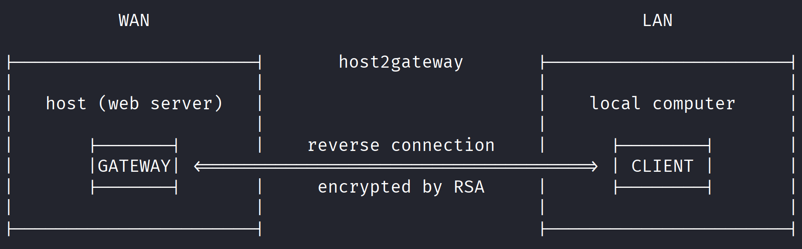

# host2gateway

**host2gateway** is a tool designed to provide access from a web server (Gateway) to a client **without requiring static IP addresses, port forwarding, changing firewall rules, or other complex configurations**. It is written in PHP and can be deployed on most hosting provider environments.

## Features

- **No need for static IP or port forwarding:** No modifications to your firewall or router settings are required.
- **Platform-independent:** Works anywhere PHP 8.2 or higher is supported, making it suitable for most shared hosting services.
- **Lightweight and simple:** Minimal dependencies and easy deployment.
- **Strong encryption built-in:** Uses RSA encryption to secure all communication, even if SSL/TLS is not available on the hosting provider. Your data is protected at all times, regardless of your environment.

## How It Works

The client establishes an outbound connection to a Gateway server that is accessible from the internet (a PHP-enabled web host). Both sides communicate through this middleman Gateway, effectively bypassing usual restrictions imposed by NAT, firewalls, and the absence of static IPs.

## Usage

1. **Upload** the `host2gateway/host` directory to your internet-accessible host or hosting provider.
2. **Copy** the `host2gateway/client` directory to your local web server.
3. **Configure** the client and server to connect and communicate with the Gateway. Simply open `http://localhost/host2gateway/client/client.php` in a browser or use curl to receive instructions.
4. **Access** your client securely and easily from anywhere via the Gateway server.

> **Note:** No need to configure UPnP, request a static IP, use port forwarding, or make changes to your firewall. All you need is PHP and a compatible server!

## Requirements

- PHP (version 8.2 or newer required)
- A web server (such as Apache or Nginx), or any hosting environment supporting PHP and SQLite
- A cron job or similar scheduler on the local computer

## Getting Started

1. Download or clone the repository:
   ```sh
   git clone https://github.com/ProfiDE/host2gateway.git
   ```

2. Upload the `host` directory to your hosting provider.

3. On your local machine (the client), configure and run the provided `client.php` script.

4. Transfer the client's public key to the `host` directory on the server and rename it to `client.pem`.

5. Set up a cron job on the client machine to run client.php at frequent intervals (e.g., every second). Example:
   ```sh
   * * * * * php /path/to/host2gateway/client/client.php

## Security

- All communications are protected by a robust encryption mechanism, which secures traffic even if the server does not provide SSL/TLS.
- Ensure the client's public key is transferred to the server securely until setup is complete. This is important to prevent man-in-the-middle (MITM) attacks.
- Avoid exposing private data unnecessarily.

## License

This project is released under the MIT License.

## Contributing

Pull requests and suggestions are welcome! For major changes, please open an issue first to discuss what you would like to change.

## Disclaimer

host2gateway is provided for legitimate and ethical use cases only. The developers assume no responsibility for any misuse or illegal activities carried out with this tool. It is the user's responsibility to comply with all applicable laws, regulations, and hosting provider terms of service. Unauthorized or malicious use may violate laws in your jurisdiction and could result in account suspension, legal penalties, or other consequences.

By using this tool, you agree to use it responsibly and exclusively for lawful purposes. The developers and maintainers disclaim any liability for damages, loss of data, security breaches, or other issues resulting from the use or misuse of host2gateway. You are solely responsible for securing your deployments and data.
